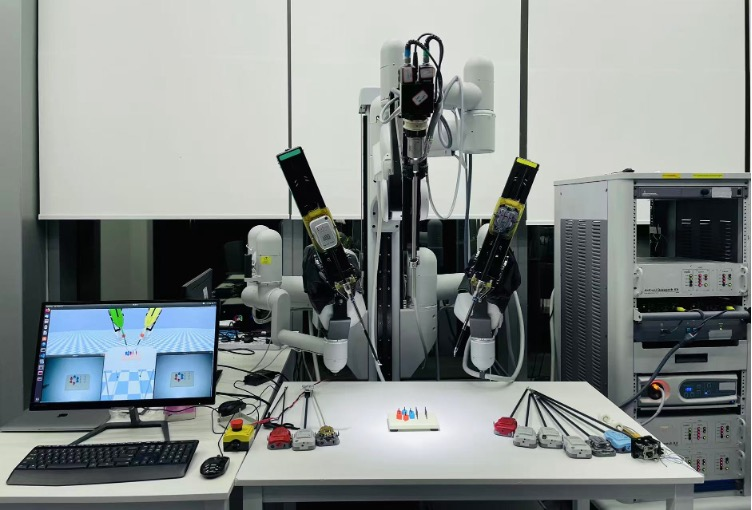
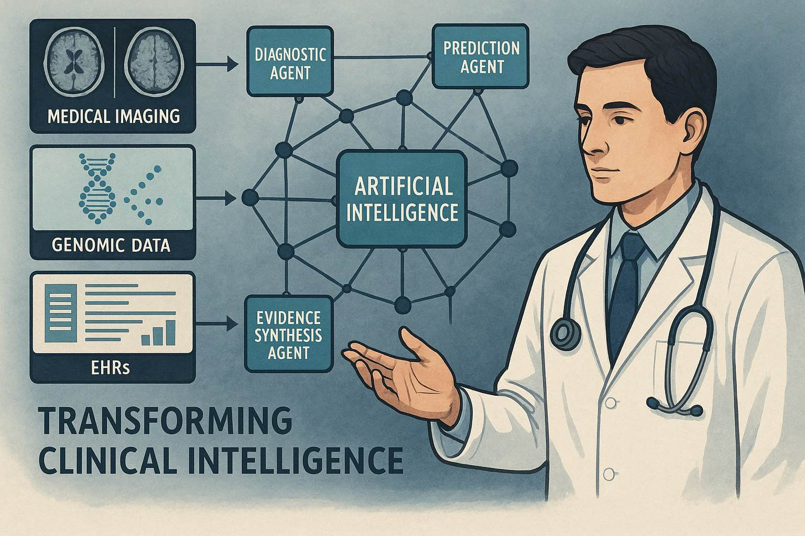
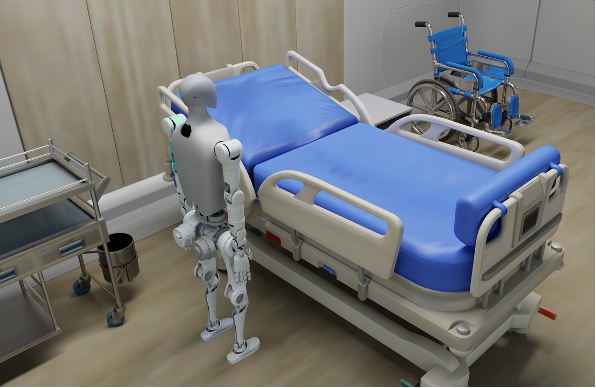
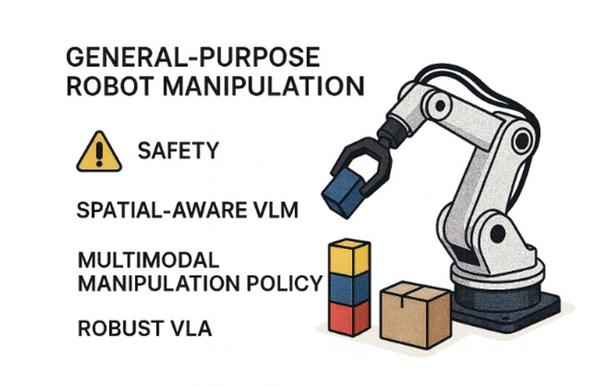

## Research Topics
Our research sits at the interdisciplinary nexus of **machine learning**, **robotic surgical intelligence** and **medical image analysis**, aiming to develop innovative intelligent systems that advance diagnosis, intervention, and medical education through next-generation healthcare technologies. Our work spans embodied AI for surgical robotics, medical image understanding, robot sensing and planning in dynamic environments, agentic AI systems for clinical decision-making, LLM for education and smart XR for medical training. Representative contributions include 3D deep learning for high-dimensional image computing, domain adaptation and generalization across heterogeneous medical data, surgical video analysis with efficient spatio-temporal learning, and visual-kinematic perception and automation in surgical robotics.

Recent focus: 1) **Surgical Robotics**, 2) **Agentic AI Systems for Healthcare Applications**, 3) **Human Robots** for Elderly Care, 4) Safe **Embodied AI**, 5) **LLMs and Smart XR** for Medical Education
 

  <!-- Card 1 -->
  

    

      
      

        

      

    

    

      <h3>Surgical Robotics</h3>
      <button class="find-more" data-topic="surgical-robotics" aria-expanded="false" aria-controls="overlay-surgical-robotics">› Find out more</button>
    

  

  <!-- Card 2 -->
  

    

      
      

        

      

    

    

      <h3>Agentic AI Systems for Healthcare Applications</h3>
      <button class="find-more" data-topic="agentic-ai" aria-expanded="false" aria-controls="overlay-agentic-ai">› Find out more</button>
    

  

  <!-- Card 3 -->
  

    

      
      

        

      

    

    

      <h3>Humanoid Robots for Elderly Care</h3>
      <button class="find-more" data-topic="elderly-care" aria-expanded="false" aria-controls="overlay-elderly-care">› Find out more</button>
    

  

  <!-- Card 4 -->
  

    

      
      

        

      

    

    

      <h3>Safe Embodied AI</h3>
      <button class="find-more" data-topic="safe-ai" aria-expanded="false" aria-controls="overlay-safe-ai">› Find out more</button>
    

  

  <!-- Card 5 -->
  

    

      
      

        

      

    

    

      <h3>LLMs and Smart XR for Medical Education</h3>
      <button class="find-more" data-topic="llm-xr" aria-expanded="false" aria-controls="overlay-llm-xr">› Find out more</button>
    

  

<template id="tpl-surgical-robotics">
  
Data Analytics and Cognitive Augmentation: It focuses on developing intelligent methods and systems that improve surgical efficiency. The work encompasses multi-modal data analysis to understand surgical scenes at multiple levels of granularity (i.e. surgical workflows, actions and anatomical structures), safety analysis to prevent adverse events during procedures, development of domain-specific large vision-language models, design of intelligent educational platforms, building augmented reality systems that provide intraoperative guidance, and virtual reality systems for immersive surgical simulation and training.

 
Embodied Intelligence for Task Autonomy: It concentrates on creating autonomous robotic systems capable of performing surgical tasks with minimal human intervention and optimal outcomes. The work involves developing surgical robot simulators that provide realistic training and testing environments for AI agents, designing the semantic and depth-aware perception algorithms for automation, advancing policy learning algorithms (i.e. imitation learning and reinforcement learning), and implementing robust frameworks capable of performing specific tasks with high safety and precision.

</template>

<template id="tpl-agentic-ai">
  
Agentic AI Systems for Healthcare Applications: This research topic aims to develop autonomous, multi-agent AI systems that integrate clinical and patient data to enable end-to-end automation of healthcare workflows. We aim to pioneer multimodal, multi-agent AI systems to revolutionize clinical intelligence by integrating diverse data streams—including medical imaging, genomic profiles, electronic health records (EHRs), and biomedical literature—into collaborative AI networks.

  
These systems deploy specialized agents (e.g., diagnostic, predictive, and evidence-synthesis agents) that dynamically interact to enhance precision medicine, accelerate disease detection, and generate patient-specific therapeutic insights. The core aim is to overcome data fragmentation and clinical complexity through coordinated AI cognition, ultimately advancing diagnostic accuracy, treatment personalization, and real-time decision support in high-stakes healthcare scenarios.

</template>

<template id="tpl-elderly-care">
 
Humanoid Robots for Intelligent Assistance in Elderly Care: The accelerating trend of global population aging presents a pressing societal challenge: a rapidly growing demand for effective elderly care solutions that can seamlessly integrate into human-centric environments. We posit that humanoid robots, with their anthropomorphic form, are uniquely suited to this role, as they are designed to navigate spaces and use tools originally intended for people.

  
Our research agenda is therefore dedicated to creating intelligent humanoid assistants for these scenarios. We will focus on advancing the core capabilities essential for this vision, including robust whole-body control for mobility and physical support in cluttered homes. We will investigate bimanual dexterous manipulation to perform complex, collaborative tasks, and tackle the nuanced challenge of deformable object manipulation for handling items like clothing and bedding. Moreover, these physical competencies are underpinned by intuitive human-robot interaction and collaboration, ensuring the robot can understand and partner with its user. The ultimate objective is to provide intelligent, personalized assistance with daily activities, professional nursing support, and meaningful companionship for elderly individuals, thereby enhancing their quality of life.

</template>

<template id="tpl-safe-ai">
  
Safe Embodied AI for General-Purpose Robot Manipulation: As robotic systems become increasingly prevalent in various scenarios of our daily life, ensuring their safety and reliability has emerged as a crucial research frontier. Our research will explore cutting-edge safe embodied AI technologies for robot manipulation.

  
Specifically, we will study spatial-aware vision-language models (VLMs) to improve the robot's 3D understanding, enabling reliable task planning that is grounded in a deep awareness of object spatial relationships and the ability to satisfy precise spatial constraints. For physical interaction, we will investigate advanced multi-modal policy learning methods that fuse language instructions with visual and tactile feedback, enabling adaptive grasping with precise and safe force control. Moreover, we will study advanced reinforcement learning methods to fine-tune vision-language-action models (VLAs), enhancing their control robustness in the presence of various environmental disturbances and sensor noises. The ultimate objective is to develop intelligent robot systems with enhanced safety and robustness in planning, grasping, and motion control for general-purpose robot manipulation.

</template>

<template id="tpl-llm-xr">
  
LLMs for Medical Education: We aim to reform and innovate research, applications, and design to advance the next generation of medical education. Our focus lies in creating a new paradigm for human-computer interaction in medical teaching, enabling medical students worldwide to access higher-quality, more reliable, and effective education and resources. Beyond professional medical training, we are equally committed to promoting public health education. By designing new interactive media and information dissemination methods, we strive to deliver health knowledge and information to people worldwide—particularly in underserved and underdeveloped regions—in a more accessible and impactful way.

  
Smart XR: This research topic focuses on developing intelligent XR (AR/VR) systems to enhance medical education and surgical assistance through immersive simulation and spatial computing. We aim to advance clinical training and intraoperative support by integrating patient-specific data, 3D anatomical modeling, and interactive visualization into adaptive XR environments. These systems combine real-time imaging, procedural guidance, and intuitive user interaction to improve anatomical understanding, skill acquisition, and surgical precision. The core goal is to bridge the gap between learning and practice by delivering context-aware, task-specific XR tools that elevate training quality, reduce surgical risk, and support decision-making in complex clinical settings.

</template>

