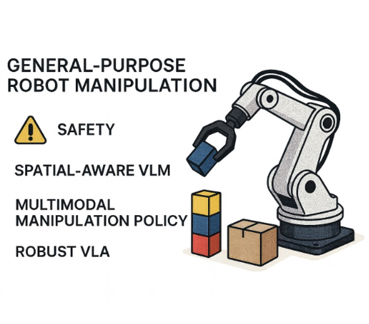

## Research Topics

<!-- Card 1 -->

  
  

    <h3>Surgical Robotics</h3>
    <a href="/research/surgical-robotics.html">› Find out more</a>
  

<!-- Card 2 -->

  
  

    <h3>Agentic AI Systems for Healthcare Applications</h3>
    <a href="/research/agentic-ai.html">› Find out more</a>
  

<!-- Card 3 -->

  
  

    <h3>Humanoid Robots for Elderly Care</h3>
    <a href="/research/elderly-care.html">› Find out more</a>
  

<!-- Card 4 -->

  
  

    <h3>Safe Embodied AI</h3>
    <a href="/research/safe-ai.html">› Find out more</a>
  

<!-- Card 5 -->

  
  

    <h3>LLMs and Smart XR for Medical Education</h3>
    <a href="/research/llm-xr.html">› Find out more</a>
  

